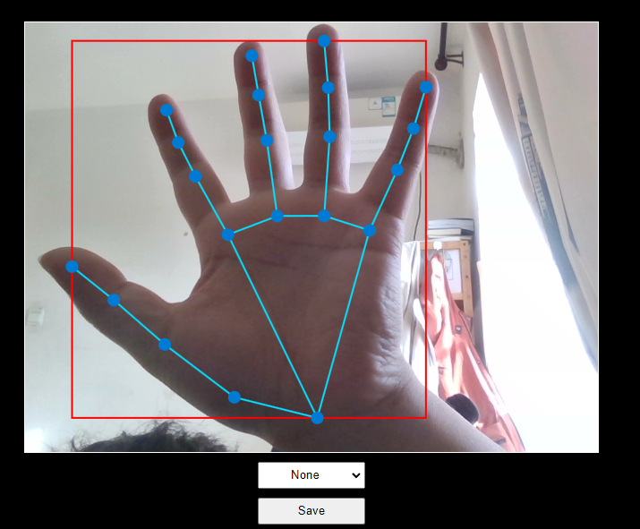
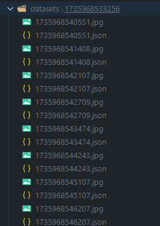

# Collecting key points and gestures based on `Mediapipe` for `YOLO Pose` training.
# 1.Start Up

```shell
npm i
npm start
```

# 2.Usage




```json
{
    "imageWidth": 640,
    "imageHeight": 480,
    "gestureCategory": "None",
    "boundingRect": [
        0.5614516139030457,
        0.35955142974853516,
        0.32319676876068115,
        0.520751953125
    ],
    "handLandmarks": [
        [
            {
                "x": 0.7457342147827148,
                "y": 0.8803033828735352,
                "z": 3.974297726472287e-7
            },
            {
                "x": 0.6762770414352417,
                "y": 0.8257445096969604,
                "z": -0.012304425239562988
            },
            {
                "x": 0.6282201409339905,
                "y": 0.7538027167320251,
                "z": -0.01690189354121685
            },
            {
                "x": 0.5922504663467407,
                "y": 0.7015834450721741,
                "z": -0.024672439321875572
            },
            {
                "x": 0.5614516139030457,
                "y": 0.6714949607849121,
                "z": -0.034337934106588364
            },
            {
                "x": 0.6741910576820374,
                "y": 0.6332882046699524,
                "z": 0.004104654770344496
            },
            {
                "x": 0.6394904255867004,
                "y": 0.5456763505935669,
                "z": -0.01080373115837574
            },
            {
                "x": 0.6202594637870789,
                "y": 0.48446375131607056,
                "z": -0.0257280133664608
            },
            {
                "x": 0.6074552536010742,
                "y": 0.43097513914108276,
                "z": -0.03794977441430092
            },
            {
                "x": 0.7229866981506348,
                "y": 0.6124351620674133,
                "z": -0.0076433694921433926
            },
            {
                "x": 0.7123659253120422,
                "y": 0.495212197303772,
                "z": -0.021696485579013824
            },
            {
                "x": 0.706188976764679,
                "y": 0.4204539656639099,
                "z": -0.038026079535484314
            },
            {
                "x": 0.7022315859794617,
                "y": 0.35955142974853516,
                "z": -0.04954836145043373
            },
            {
                "x": 0.7731502056121826,
                "y": 0.6197804808616638,
                "z": -0.023731326684355736
            },
            {
                "x": 0.7781743407249451,
                "y": 0.5033551454544067,
                "z": -0.04532606899738312
            },
            {
                "x": 0.7801620364189148,
                "y": 0.4337502717971802,
                "z": -0.0632835403084755
            },
            {
                "x": 0.7797338366508484,
                "y": 0.3738180696964264,
                "z": -0.07447515428066254
            },
            {
                "x": 0.8227076530456543,
                "y": 0.6497356295585632,
                "z": -0.040951162576675415
            },
            {
                "x": 0.8536694049835205,
                "y": 0.5667926073074341,
                "z": -0.060638245195150375
            },
            {
                "x": 0.87239009141922,
                "y": 0.512020468711853,
                "z": -0.06928631663322449
            },
            {
                "x": 0.8846483826637268,
                "y": 0.46198898553848267,
                "z": -0.07447515428066254
            }
        ]
    ]
}
```


# 3.Convert to YoLo Pose
```python
#TODO
```

# 4.Package
```shell
npm run package
```

